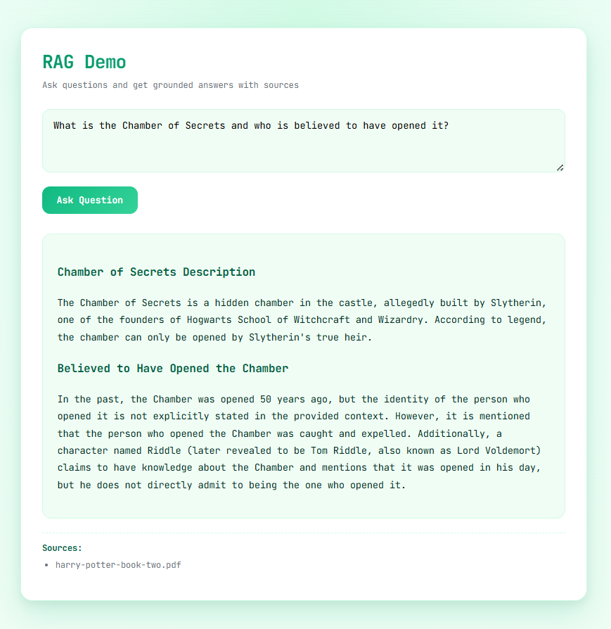
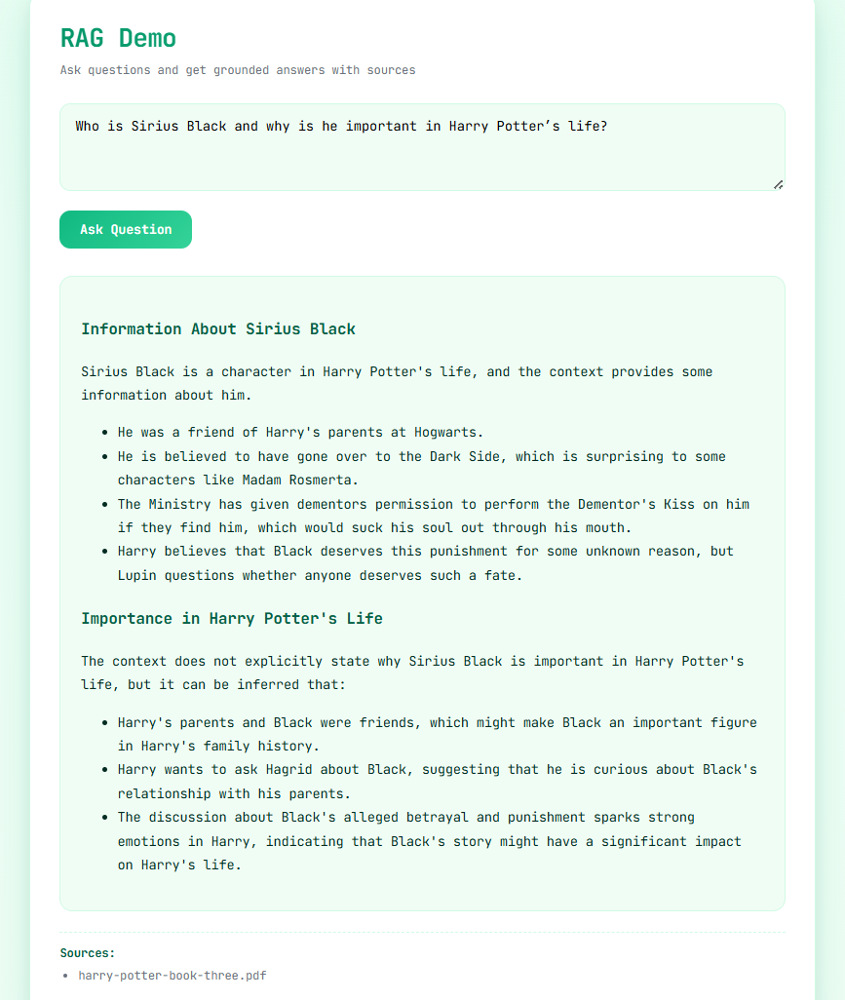
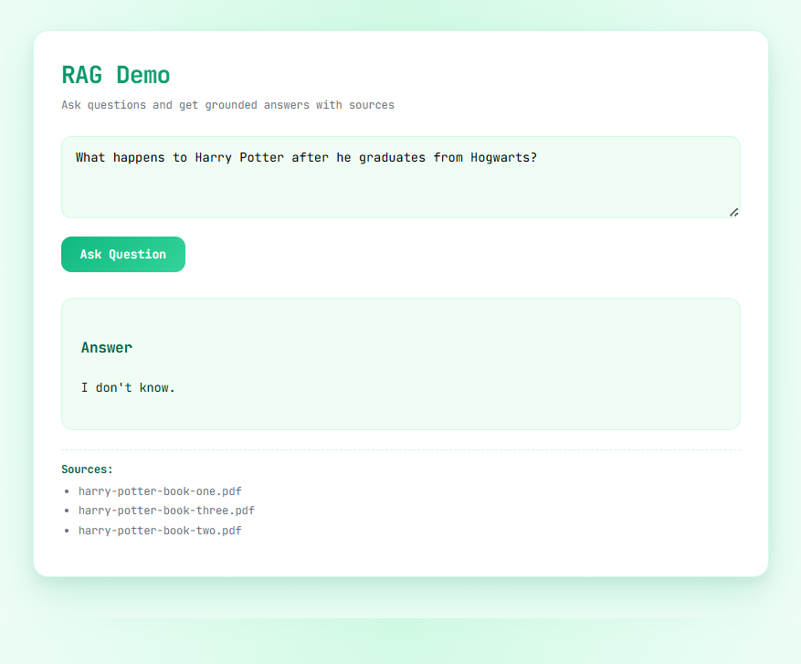

# Retrieval-Augmented Generation (RAG) Demo

This project implements a **Retrieval-Augmented Generation (RAG)** system that answers user queries using information retrieved from a custom document corpus. It combines **semantic search (FAISS)** with a **Groq-hosted LLaMA model** to generate grounded, source-backed answers.

The project is designed to be **CPU-only**, **Lightning.ai compatible**, and easy to explain in hackathons, evaluations, or interviews.

---

## 📸 Evaluation Examples

### [1] Question from Book 2 (Correct Answer)


---

### [2] Question from Book 3 (Correct Answer)


---

### [3] Question Beyond the Corpus (Correct “I Don’t Know” Response)



## 🚀 Features

* PDF document ingestion
* Text chunking for semantic retrieval
* Sentence-transformer embeddings
* FAISS vector database for similarity search
* Groq LLaMA model for answer generation
* FastAPI backend
* Simple browser UI
* Markdown-formatted answers
* Visible document sources

---

## 🧠 Architecture Overview

```
PDF Documents
     ↓
Text Extraction
     ↓
Chunking
     ↓
Sentence Embeddings
     ↓
FAISS Vector Store
     ↓
User Query
     ↓
Similarity Search (Top-K)
     ↓
Context Injection
     ↓
Groq LLaMA Model
     ↓
Formatted Answer + Sources
```

---

## 📁 Project Structure

```
mini-rag/
│
├── data/
│   └── docs/                # PDF documents
│
├── ingest/
│   ├── load_docs.py         # PDF → raw text
│   ├── chunk_docs.py        # Text chunking
│   └── embed_store.py       # Embeddings + FAISS
│
├── backend/
│   ├── __init__.py
│   ├── rag.py               # Retrieval logic
│   └── app.py               # FastAPI backend
│
├── frontend/
│   └── index.html           # Browser UI
│
├── faiss_index/
│   ├── index.faiss
│   └── metadata.pkl
│
├── .env
├── README.md
```

---

## 🛠️ Requirements

* Python **3.10 or higher**
* CPU-only environment (no GPU required)
* Groq API key

---

## 🔧 Installation

### 1. Create a virtual environment

```bash
python -m venv venv
source venv/bin/activate        # Linux / macOS
venv\Scripts\activate           # Windows
```

---

### 2. Upgrade pip tooling

```bash
pip install --upgrade pip setuptools wheel
```

---

### 3. Install CPU-only PyTorch

```bash
pip install torch --index-url https://download.pytorch.org/whl/cpu
```

---

### 4. Install remaining dependencies

```bash
pip install \
  fastapi \
  uvicorn \
  groq \
  python-dotenv \
  pypdf \
  langchain-text-splitters \
  sentence-transformers \
  faiss-cpu
```

---

## 🔐 Environment Variables

Create a `.env` file in the project root:

```
GROQ_API_KEY=your_groq_api_key_here
```

---

## 📄 Step-by-Step Usage

### STEP 1: Add Documents

Place your PDF files inside:

```
data/docs/
```

Example:

```
harry-potter-book-one.pdf
harry-potter-book-two.pdf
harry-potter-book-three.pdf
```

---

### STEP 2: Ingest and Chunk Documents

```bash
cd ingest
python load_docs.py
python chunk_docs.py
```

---

### STEP 3: Generate Embeddings and FAISS Index

```bash
python embed_store.py
```

This will create:

```
faiss_index/
├── index.faiss
└── metadata.pkl
```

---

### STEP 4: Run the Backend Server

From the project root:

```bash
uvicorn backend.app:app --reload
```

The server will run at:

```
http://127.0.0.1:8000
```

---

### STEP 5: Test the API (Optional)

Open in browser:

```
http://127.0.0.1:8000/docs
```

Use the **POST /ask** endpoint to test queries.

---

### STEP 6: Run the Frontend UI

Open the UI file:

```
frontend/index.html
```

The UI sends requests to the FastAPI backend and displays:

* Markdown-formatted answers
* Source document names

---

## 🧪 Example Query

**Question:**

```
Who is Harry Potter?
```

**Response:**

* Formatted answer generated by the LLM
* Sources such as:

  * harry-potter-book-one.pdf
  * harry-potter-book-two.pdf

---

## 🔍 Why Retrieval-Augmented Generation?

* Reduces hallucinations
* Grounds answers in real documents
* Makes LLM outputs explainable and auditable
* Enables domain-specific QA

---

## 🧑‍💻 Notes

* The corpus is **swappable** without code changes
* The system is embedding-agnostic
* The UI is intentionally minimal to emphasize correctness over styling

---

## 📌 Possible Extensions

* Clickable sources with chunk preview
* Inline citations ([1], [2])
* Dark mode UI
* Deployment on cloud platforms

---

## ✅ Status

✔ Fully working RAG pipeline
✔ Backend + frontend integrated
✔ Ready for demo, submission, or evaluation
